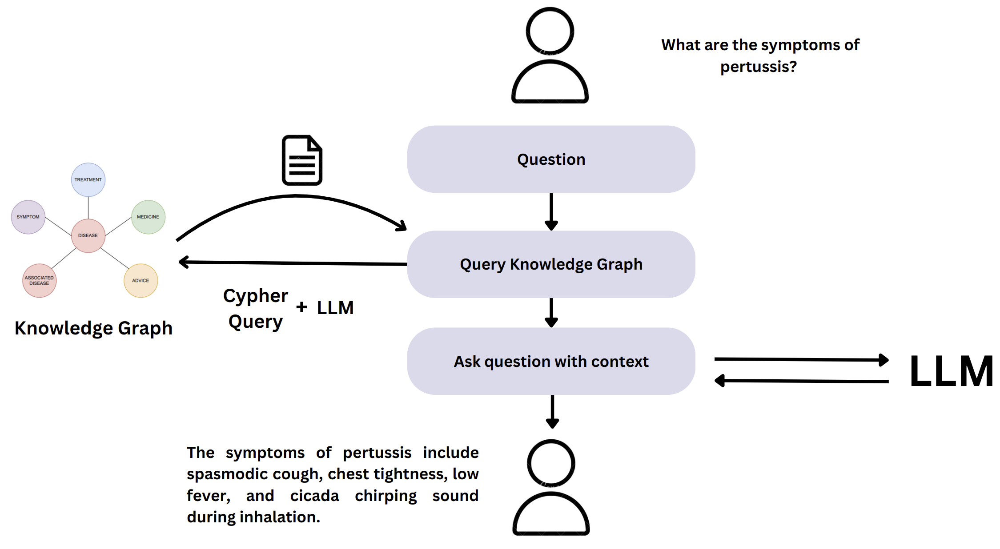

# VietMedKG: Knowledge Graph and Benchmark for Traditional Vietnamese Medicine

Paper: https://doi.org/10.1101/2024.08.07.606195



### 1. Contributors:

- Tam Trinh
- Anh Hoang
- Hy Truong Son (Correspondent / PI)

### 2. Setup

To set up the project, follow these steps:

#### 1. Clone the project

```bash
git clone https://github.com/HySonLab/VieMedKG.git
```

#### 2. Create a Conda Environment

First, create a new conda environment named `vietmedkg`:

```bash
conda create --name vietmedkg python=3.8
```

Activate the newly created environment:

```bash
conda activate vietmedkg
```

#### 3. Install Required Packages

Once the environment is activated, install the required packages using `pip` and the `requirements.txt` file:

```bash
pip install -r requirements.txt
```

#### 3. Usage

Please navigate to the file `key.env` and fill in the information:

```
OPENAI_API_KEY = ""
GOOGLE_API_KEY = ""
URI=""
USER="neo4j"
PASSWORD=""
```

#### 4. Project Structure

```
.
├── data/                 # Data files
├── experiments/          # Experiments code
├── preprocessing/        # Data creation code
├── results/              # Output result of the experiments
├── key.env               # The API key to run the code
├── requirements.txt      # Python dependencies
├── README.md             # Project documentation
```

### 5. Contribution Guidelines

We welcome contributions from the community. If you're interested in contributing to the VieMedKG project, please follow these guidelines:

- **Fork the repository**: Start by forking the repository to your GitHub account.
- **Create a branch**: Create a new branch for your feature or bug fix.
- **Commit changes**: Make your changes and commit them with clear and descriptive messages.
- **Submit a pull request**: Once you're satisfied with your changes, submit a pull request to the main repository for review.

### 6. License

This project is licensed under the MIT License. See the `LICENSE` file for more information.

### Please cite our work

```bibtex
@article {Trinh2024.08.07.606195,
	author = {Trinh, Tam and Hoang, Anh and Nhung, Hy Thi Hong and Hy, Truong Son},
	title = {VieMedKG: Knowledge Graph and Benchmark for Traditional Vietnamese Medicine},
	elocation-id = {2024.08.07.606195},
	year = {2024},
	doi = {10.1101/2024.08.07.606195},
	publisher = {Cold Spring Harbor Laboratory},
	abstract = {Traditional Vietnamese Medicine (TVM) and Traditional Chinese Medicine (TCM) have shared significant similarities due to their geographical location, cultural exchanges, and hot and humid climatic conditions. However, unlike TCM, which has substantial works published to construct a knowledge graph, there is a notable absence of a comprehensive knowledge graph for TVM. This paper presents the first endeavor to build a knowledge graph for TVM based on extensive existing resources from TCM. We name our knowledge graph as VieMedKG. We propose a translation and filtration process to adapt TCM knowledge graphs to TVM, identifying the overlapping and unique elements of TVM. In addition, the constructed knowledge graph is then exploited further for developing a curated benchmark for the knowledge graph-based question-answering problem with the potential to support doctors and patients in assisting doctors and patients in identifying various diseases. Our work will not only bridge the gap between TCM and TVM but also set the foundation for future research into traditional Vietnamese medicine community. Our source code is publicly available at https://github.com/HySonLab/VieMedKG/ .Competing Interest StatementThe authors have declared no competing interest.},
	URL = {https://www.biorxiv.org/content/early/2024/08/09/2024.08.07.606195},
	eprint = {https://www.biorxiv.org/content/early/2024/08/09/2024.08.07.606195.full.pdf},
	journal = {bioRxiv}
}
```
